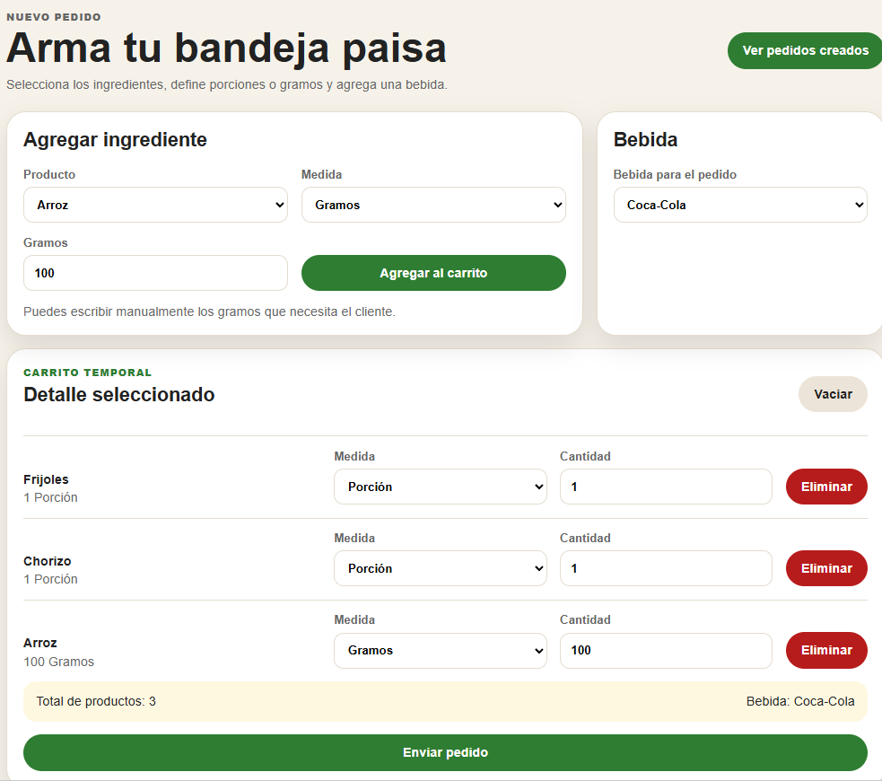
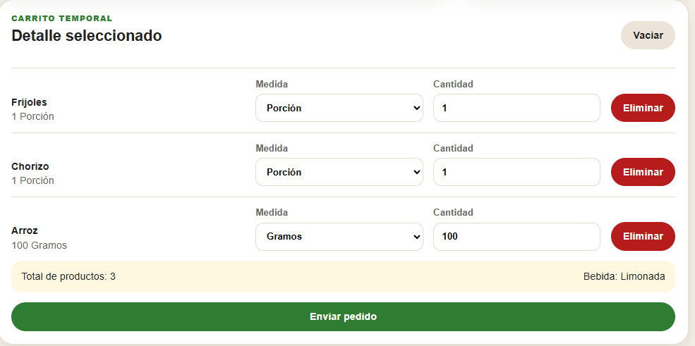
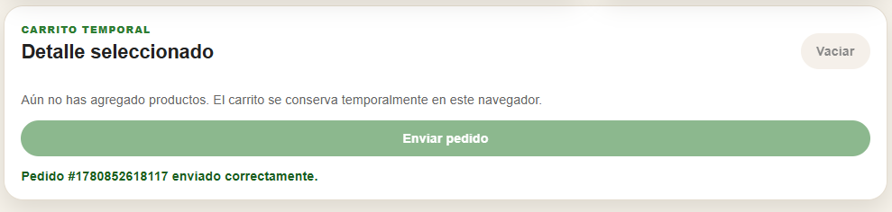
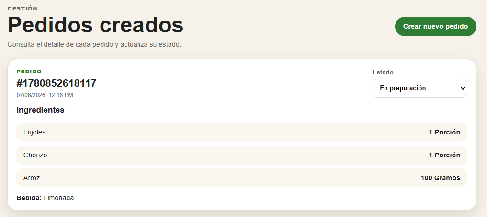
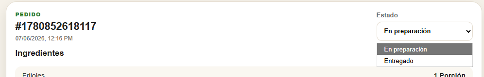

# 1. Plan de Pruebas del Sistema

## 1.1 Objetivo del plan de pruebas

Validar que la aplicación web para la creación de pedidos de bandeja paisa funcione correctamente de acuerdo con los requisitos definidos. Las pruebas estarán enfocadas en verificar que el usuario pueda seleccionar alimentos, definir cantidades por porción o gramos, agregar bebidas, gestionar un carrito temporal, enviar pedidos y consultar posteriormente el estado de cada pedido.

## 1.2 Estrategia de pruebas utilizada

La estrategia seleccionada corresponde a **pruebas unitarias**, ya que permiten validar de forma individual las funciones principales del sistema. Estas pruebas se enfocan en comprobar que cada componente, método o servicio de la aplicación funcione correctamente antes de integrarse con el resto del sistema.

En el caso de la aplicación desarrollada en Angular, las pruebas unitarias se aplican principalmente sobre:

- La lógica de selección de productos.
- El almacenamiento temporal del carrito.
- La eliminación de productos seleccionados.
- La modificación de cantidades.
- La validación de pedidos antes del envío.
- El registro de pedidos creados.
- El cambio de estado del pedido entre **En preparación** y **Entregado**.

## 1.3 Herramientas de prueba

Para la ejecución de pruebas unitarias se propone el uso de las herramientas incluidas por defecto en Angular:

| Herramienta | Descripción |
|---|---|
| Jasmine | Framework para definir los casos de prueba. |
| Karma | Ejecutor de pruebas que permite correr los tests en el navegador. |
| Angular TestBed | Utilidad para configurar y probar componentes, servicios y dependencias de Angular. |

## 1.4 Casos de prueba unitarios

| ID | Caso de prueba | Objetivo | Datos de entrada | Resultado esperado | Estado |
|---|---|---|---|---|---|
| CP-01 | Agregar alimento al carrito | Validar que un alimento seleccionado sea agregado correctamente al carrito. | Producto: arroz, cantidad: 1, unidad: porción. | El producto aparece en el carrito. | Exitoso |
| CP-02 | Agregar alimento por gramos | Validar que el usuario pueda ingresar una cantidad manual en gramos. | Producto: carne molida, unidad: gramos, cantidad: 250. | El producto se guarda con unidad gramos y cantidad 250. | Exitoso |
| CP-03 | Validar cantidad inválida | Evitar que se agreguen productos con cantidades menores o iguales a cero. | Producto: frijoles, cantidad: 0. | El sistema muestra validación y no agrega el producto. | Exitoso |
| CP-04 | Eliminar producto del carrito | Verificar que un producto pueda ser eliminado del carrito temporal. | Producto previamente agregado. | El producto desaparece del carrito. | Exitoso |
| CP-05 | Actualizar cantidad | Validar que el usuario pueda modificar la cantidad de un producto seleccionado. | Producto: chicharrón, nueva cantidad: 2. | La cantidad se actualiza correctamente. | Exitoso |
| CP-06 | Seleccionar bebida | Validar que el usuario pueda elegir una bebida para el pedido. | Bebida: limonada. | La bebida queda asociada al pedido. | Exitoso |
| CP-07 | Enviar pedido válido | Comprobar que el sistema permita crear un pedido cuando existen productos seleccionados. | Carrito con alimentos y bebida. | Se crea un nuevo pedido en estado **En preparación**. | Exitoso |
| CP-08 | Evitar pedido vacío | Validar que no se pueda enviar un pedido sin productos seleccionados. | Carrito vacío. | El sistema impide el envío del pedido. | Exitoso |
| CP-09 | Consultar pedidos creados | Verificar que los pedidos enviados se visualicen en la segunda vista. | Pedido previamente creado. | El pedido aparece con su detalle completo. | Exitoso |
| CP-10 | Cambiar estado del pedido | Validar que el estado del pedido pueda cambiarse desde un combo box. | Estado: Entregado. | El pedido cambia de **En preparación** a **Entregado**. | Exitoso |

## 1.5 Evidencias simuladas de resultados obtenidos

| Módulo probado | Pruebas ejecutadas | Pruebas exitosas | Pruebas fallidas | Resultado |
|---|---:|---:|---:|---|
| Carrito de compras | 5 | 5 | 0 | Correcto |
| Selección de bebida | 1 | 1 | 0 | Correcto |
| Creación de pedidos | 2 | 2 | 0 | Correcto |
| Vista de pedidos | 1 | 1 | 0 | Correcto |
| Cambio de estado | 1 | 1 | 0 | Correcto |

Resultado general simulado:

```text
TOTAL: 10 pruebas ejecutadas
EXITOSAS: 10
FALLIDAS: 0
COBERTURA FUNCIONAL SIMULADA: 100%
ESTADO GENERAL: APROBADO
```

## 1.6 Evidencias visuales asociadas

### Carrito con productos seleccionados

<div align="center">
  
</div>

### Revisión del carrito antes del envío

<div align="center">
  
</div>

### Pedido enviado correctamente

<div align="center">
  
</div>

### Vista de pedidos creados

<div align="center">
  
</div>


### Cambio de estado del pedido

<div align="center">
  
</div>


## 1.7 Conclusión de las pruebas

Las pruebas unitarias  permiten evidenciar que la aplicación cumple con las funcionalidades principales definidas para la creación y gestión de pedidos de bandeja paisa. El sistema permite seleccionar productos, manejar cantidades, registrar bebidas, enviar pedidos y actualizar su estado correctamente.
