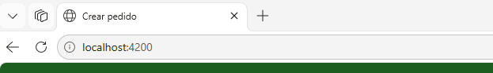
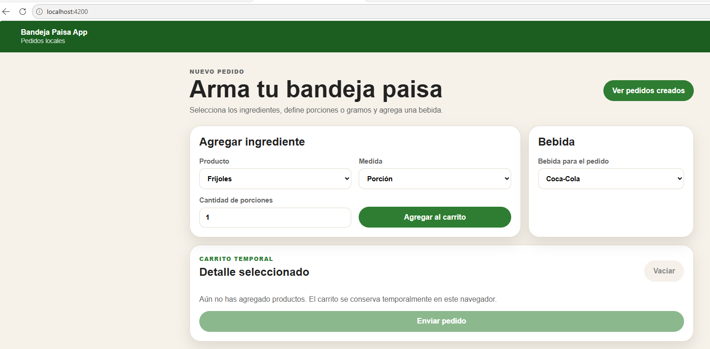
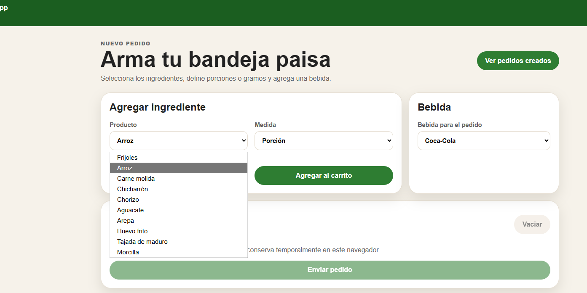
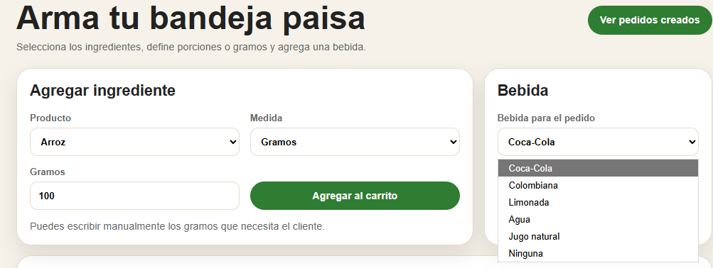
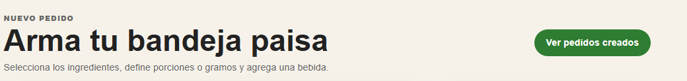

# 2. Manual básico de usuario del sistema

## Objetivo del sistema

El sistema permite crear pedidos personalizados de bandeja paisa mediante una página web ejecutada de manera local. El usuario puede seleccionar los alimentos que desea incluir en su plato, definir cantidades, elegir una bebida y enviar el pedido. Posteriormente, puede consultar los pedidos creados y actualizar su estado.

## Acceso al sistema

Para ingresar al sistema, el usuario debe ejecutar la aplicación localmente y abrirla desde el navegador web mediante la siguiente dirección:

```text
http://localhost:4200
```

<div align="center">
  
</div>

## 1. Pasos para crear el pedido:


1. Ingresar a la vista principal de la aplicación.
<div align="center">
  
</div>

2. Revisar la lista de ingredientes disponibles para la bandeja paisa.
El usuario puede seleccionar los ingredientes desde un listado desplegable. Esto permite personalizar la bandeja paisa de acuerdo con lo solicitado.
<div align="center">
  
</div>

3. Seleccionar los alimentos que se desean agregar al plato.
4. Definir la cantidad deseada.
5. Elegir si la cantidad corresponde a **porción** o **gramos**.
6. Si se selecciona la opción **gramos**, ingresar manualmente la cantidad deseada.
El sistema permite manejar dos tipos de medida:

| Medida | Descripción |
|---|---|
| Porción | Se utiliza cuando el usuario desea seleccionar una cantidad estándar del ingrediente. |
| Gramos | Se utiliza cuando el usuario desea escribir manualmente una cantidad específica. |

Cuando se selecciona la opción **gramos**, el usuario puede escribir el valor manualmente.
<div align="center">
  
</div>


7. Seleccionar la bebida del pedido.
El usuario puede elegir una bebida para asociarla al pedido.
<div align="center">
  
</div>


8. Revisar el carrito 
Antes de enviar el pedido, el usuario puede revisar el detalle de los productos seleccionados. El carrito muestra los ingredientes, cantidades, unidad de medida y bebida seleccionada.

<div align="center">
  
</div>


Desde el carrito, el usuario puede:

- Modificar cantidades.
- Cambiar la unidad de medida.
- Eliminar productos.
- Vaciar el carrito.
- Enviar el pedido.

9. Si es necesario, modificar cantidades o eliminar productos.
10. Presionar el botón **Enviar pedido**.
Después de revisar el carrito, el usuario debe presionar el botón **Enviar pedido**. Cuando el pedido se registra correctamente, el sistema muestra un mensaje de confirmación.
<div align="center">
  
</div>


## 2. Consultar pedidos creados

Para consultar los pedidos registrados, el usuario debe hacer clic en el botón o enlace **Ver pedidos creados**.
<div align="center">
  
</div>


En la vista de pedidos, el usuario puede consultar el detalle de cada pedido, incluyendo:

- Número o identificador del pedido.
- Fecha y hora de creación.
- Ingredientes seleccionados.
- Cantidades.
- Unidad de medida.
- Bebida seleccionada.
- Estado del pedido.

<div align="center">
  
</div>


## 3. Cambiar estado de un pedido

Cada pedido cuenta con un campo de estado que puede modificarse desde un combo box. Los estados disponibles son:

- **En preparación**.
- **Entregado**.

Para cambiar el estado, el usuario debe seleccionar la opción correspondiente en el combo box del pedido.

<div align="center">
  
</div>


## 4. Eliminar productos del carrito

Antes de enviar el pedido, el usuario puede retirar productos del carrito. Para hacerlo, debe seleccionar la opción **Eliminar** asociada al producto que desea quitar.
